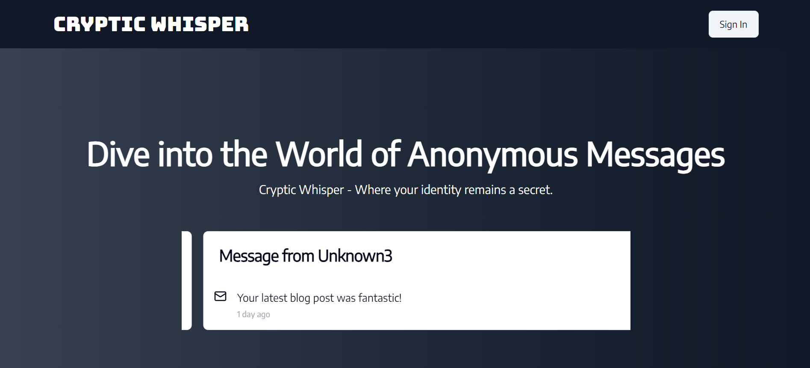
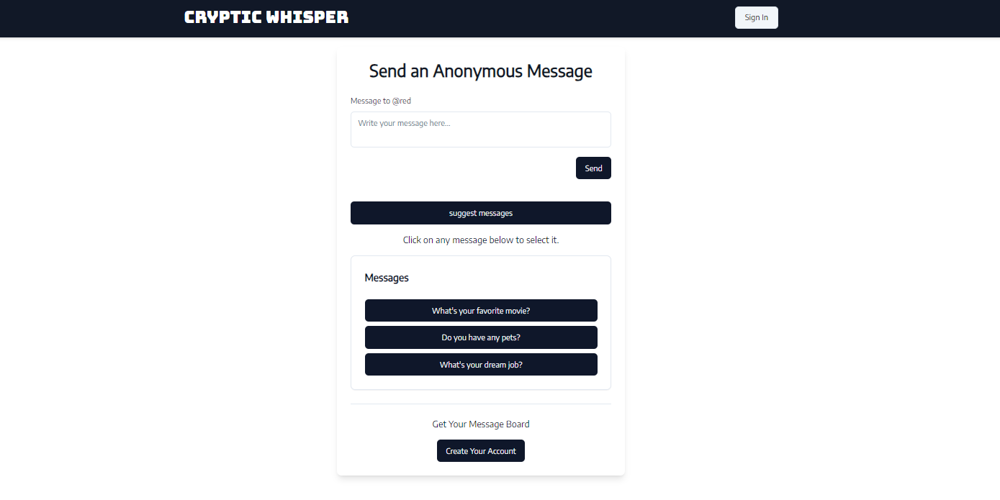

# Cryptic Whisper

Cryptic Whisper is a Next.js application that allows users to send anonymous messages through a shareable public link. This project incorporates secure authentication, message suggestions, and responsive design.

## Features

- **Anonymous Messaging:** Users can create a public link for others to send messages anonymously.
- **Secure Authentication:** Implemented with Next Auth for user authentication.
- **OTP Verification:** Integrated SendGrid for one-time password (OTP) verification.
- **Message Suggestions:** Utilized Vercel AI SDK and Google Gemini API for intelligent message suggestions.
- **Responsive UI:** Designed using Tailwind CSS and Shadcn.
- **Type Safety:** Written in TypeScript for robust type checking.
- **Data Storage:** MongoDB for efficient and scalable database management.
- **Validation:** Zod for schema validation.

## Tech Stack

- **Frontend:** Next.js, Tailwind CSS, Shadcn
- **Backend:** Next.js API Routes, MongoDB, Mongoose
- **Authentication:** Next Auth, SendGrid
- **Message Suggestions:** Vercel AI SDK, Google Gemini API
- **Validation:** Zod

